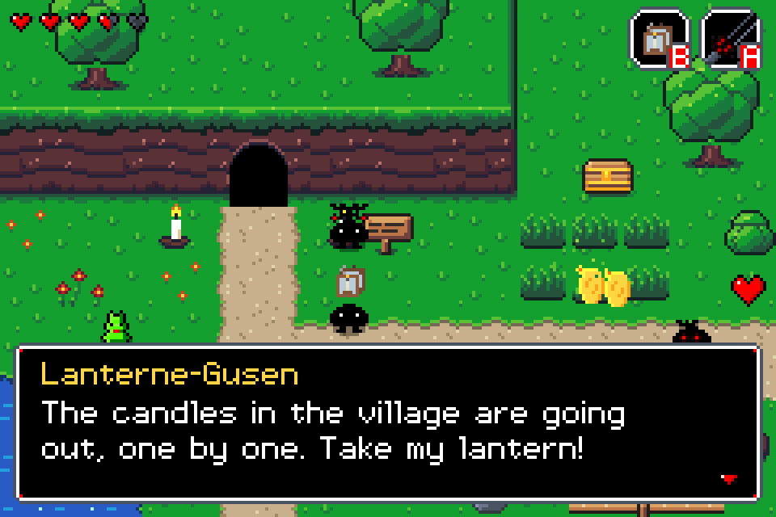
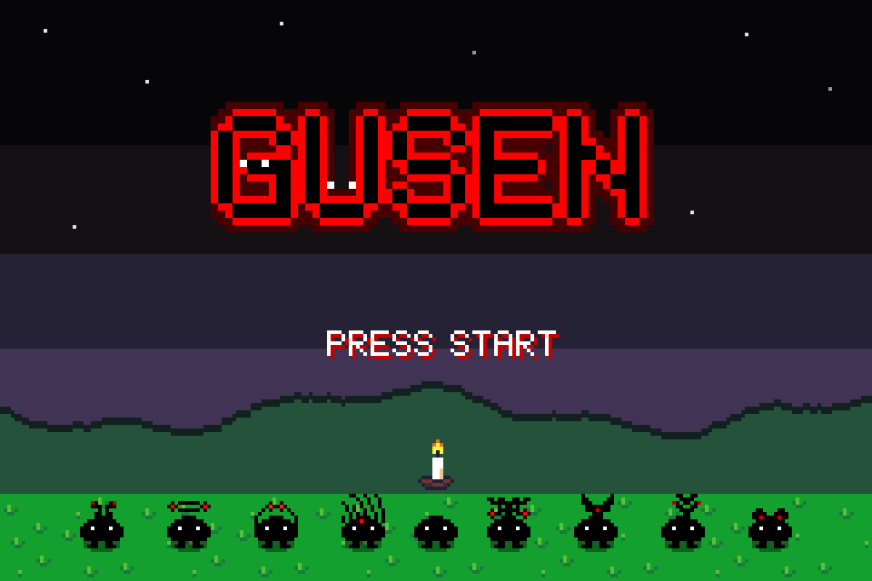

# Gusen: rebuild plan

**Short version:** throw away the current platformer code, keep the Gusens and
the art, and rebuild it as a small **top-down GBA-style action-adventure**
(think *Zelda: Minish Cap* on one cartridge). It runs at a true **240×160**,
uses 16×16 tiles, and works on your handheld through PortMaster. A first set
of matching pixel art is already in [`assets/`](assets/README.md).


*Every pixel above is a real 1x asset from this repo (new tiles and sprites,
plus your candle, frog, mushroom, coin and lantern), scaled ×4. Nothing is
painted over.*

> **What I analyzed:** the GitHub repo `DankMiimer/Gusen` (branch `main`). I
> can't reach `\\GAMEBOY\share\roms\ports\Top down game` from here because it's
> on your local network. If the copy there is newer, push it and I'll re-check.
> Per your request, none of the `.jpg` files (table, bush, dresser, chairs,
> scary tree) are used or referenced.

---

## 1. What the current game is

`game.html` is a ~2,000-line single-file canvas **side-scroller**: an 800×600
canvas, a 6,400 px wide level of floating planks, 16 walking/flying enemies, a
sword, stomping, double/wall-jumping, coins and gems, 4 checkpoints and a goal
flag.

### What's worth keeping

* **The Gusens.** Black 12×15 silhouettes with 1-px white eyes are a strong,
  readable, very GBA idea. Each named Gusen (Ding, Gress, Lanterne, Luna,
  Spaghetti, Wireless, Generator) already has a personality in its silhouette.
* **`Mega_Spritesheet.ase`:** a whole house's worth of furniture, floors,
  cobblestone, pine trees, food, a lantern and a throne. A curated part of it
  covers interiors, the forest and the shop. See section 2.
* **The newer Aseprite art** (Nov 2025) tells a story by itself: a candle being
  blown out, a glowing red sword, a hopping frog, a spore mushroom, an exploding
  microwave, coins, a flower that grows in 7 stages, wind in the grass. None of
  it is used by `game.html` yet. The new design is built around it.

### What's holding it back

**Design**

* No reason to play: walk right to the flag. Coins and gems only raise a
  score, and there's nothing to spend them on or unlock.
* The named Gusens, the best thing in the repo, are used as anonymous enemies
  that hurt you. The README says you "earn points by meeting" them; the code
  says they damage you (`damagePlayer`, `game.html:1914`).
* Level is a flat line of planks in unrelated styles (crystal, metal, cloud)
  that don't match any of the art.
* Enemies all behave the same, die in one hit with no knockback, and
  "walking off the world just keep[s] falling" (`game.html:1069`).
* The sword has a **1.5 s cooldown** (`game.html:755`) for a 20-frame swing, so
  combat feels sluggish. Stomp does the same job.

**Tech**

* **Speed depends on the monitor:** physics runs once per
  `requestAnimationFrame` with no delta time, so on a 120/144 Hz screen the
  game runs 2–2.4× faster.
* **Sound breaks after a while:** every sound makes a new `AudioContext`
  (`game.html:1212`) that is never closed, and browsers cap how many you can
  create.
* **Caps Lock / Shift stops movement:** keys are stored by `e.key`
  (`game.html:1942`), so `A` ≠ `a`.
* **Checkpoint hitbox bug:** it uses the checkpoint's height instead of the
  player's (`game.html:717`).
* No restart: "Try again" reloads the page (`game.html:1965`), and the win
  screen says "Refresh to play again" (`game.html:1656`).
* Dead code: power-ups and moving platforms (`Powerup`, `CONFIG.powerups`,
  `CONFIG.movingPlatform`, `sounds`) are still in the file.
* The debug text "Position: 1234px" is in the HUD (`game.html:1595`).
* Keyboard only: no gamepad, so it can't really run on a handheld.

**Not pixel perfect**

* Mixed pixel sizes: sprites are drawn at 4× (48×60), but platforms, trees,
  particles and UI are drawn at 1× with `fillRect`, Arial and monospace text.
  The sword is rotated to arbitrary angles and particles fade with
  `globalAlpha`. On a real GBA everything shares one pixel grid.
* Colours are ad-hoc CSS hex values, not a palette.
* `generatorgusen.png` has ~20 semi-transparent pixels (alpha 3–232),
  probably soft-brush strokes. They should be solid or empty.
* `player.png` and `sprite5.png` are identical files.
* `Left/Middle/Right_Grass_Platform.png` are 12×15 with 117–135 colours each.
  They're a resampled painting, not pixel art. Retire them; the new path and
  cliff tiles replace them.

Verdict: a rewrite is cheaper than a repair. There's no engine structure worth
porting, and the art and characters carry over without it.

---

## 2. The pixel art: what's there and the rules going forward

Full style guide with every rule, file and frame: **[`assets/README.md`](assets/README.md)**.


There are three families:

1. **Gusens (PNG, 12×30 = two 12×15 frames: top faces left, bottom faces right).**
   Pure black, no outline, 1-px white eyes, and a red "glow" ramp
   (`#2b0000 → #ff0000 → #ffe3e3`). 2–10 colours each. The eyes alone carry
   the facing direction.
2. **Objects (Aseprite, 12×15 / 16×16 / 32×32).** Coloured, light from the
   top-left, flat shading, black outlines on creatures and items, same-hue
   outlines on nature. Three different palettes are mixed:
   * **AAP-64:** Penge, Terreng Gress og sørpe, Voksende rød blomst
   * **DB32:** Blåse ut lys, Fluesopp med sporer, Vind i gress
   * **free-picked (MS Paint-style) colours:** frog, microwave, sword

3. **`Mega_Spritesheet.ase` (400×400, 271 colours, own palette).** Furniture
   in the same maroon ramp as Terreng (`#8e5252 / #5b3138 / #422433`, which are
   AAP-64), warm wood browns, grey cobblestone, olive pines, and a separate
   olive grass family (`#61a53f`).

**Decision:** standardise on **AAP-64 + "Gusen ink"** (black, white, the red
ramp): 74 colours, max 15 per sprite. The master palette is at
`assets/palette/gusen-master.gpl`. The old DB32 and free-picked sprites still
look fine next to it. Mega pieces keep their own colours for now: they're
copied pixel for pixel. A later cleanup step can move everything onto the
palette (see M6).

### From the Mega sheet: chosen, not dumped in

43 pieces go into the game (in `assets/mega/`, pixels untouched). **Everything
with a job is in:** all the tables, the cobblestone (it already repeats every
16 px, so it tiles), floors, chairs, cabinets, dresser, bookshelf, rug, door and
windows, candle stands and the 4-frame candle dish, the lantern, food, the
wallet, pines, the hollow log, sunflowers and the golden throne. **Left out:**
the second grass family and dirt ring (they clash with the overworld grass),
the cave hole (duplicate), the TVs (low contrast), the aquarium and pink
loveseat (37 and 20 colours) and near-duplicates. The full table with reasons
is in [`assets/README.md`](assets/README.md#mega_spritesheetase-whats-used-and-why).


New tiles were drawn to connect it all: **interior walls** in the furniture's
maroon (back wall with wallpaper and wainscot, side and front walls, corners).

| Spaghetti-Gusen's restaurant | Skogen |
|---|---|
|  |  |

### New assets made for this plan (all 1x, generated by `tools/make_assets.py`)


* **Overworld tiles:** grass and flower grass, path and pond autotiles with
  animated water, a top-down cliff face built from your *Terreng* tile, a cave
  mouth, a tree, a bush, rocks, cuttable tall grass, a sign, chests, a pot, a
  fence, a stump.
* **Player Gusen:** 4 directions × idle, walk (2 frames) and attack.
* **Enemies:** Skyggegusen (4-dir red-eyed shadow), bat, and a 32×32 boss
  (Skyggekongen).
* **NPC front/back frames** for 8 of your Gusens, so they can face the player.
* **Items:** heart, key, red shard, spaghetti (a healing food). The lantern is
  yours, from the Mega sheet.
* **Combat FX:** the Glødende Sverd on the master palette in 4 diagonals, a
  slash arc, hit spark, death smoke, dust, cut leaves, spores, a drop shadow.
* **UI:** a variable-width pixel font with ÆØÅ, a 9-slice dialog box,
  hearts, icons, A/B item slots, cursors and a logo.
* Every animated sprite is also written as an **`.ase` file with animation
  tags**, so you can open and tweak it in Aseprite.

| Dialog | Title |
|---|---|
|  |  |

---

## 3. The new game

**Working title:** *Gusen* (or *Gusen og det siste lyset*)

**Pitch:** The candles in Gusenby keep the shadows out, and someone is blowing
them out one by one (*Blåse ut lys*). Red-eyed Skyggegusens creep in. You're
the smallest Gusen with the Glødende Sverd. Relight the candles, help your
neighbours, and chase Skyggekongen back into the dark.

### Pillars

1. **Feels good within 10 seconds.** Snappy 8-way movement, a sword with
   hit-stop and knockback, enemies that telegraph their attacks.
2. **Small world, every screen earns its place.** Each screen has a secret, a
   puzzle, a fight or a character.
3. **The Gusens are the heart.** Every named Gusen matters to progress.
4. **Authentic GBA.** 240×160, 16×16 tiles, ≤15 colours per sprite, pixel
   font, integer scaling only.

### Core loop

Explore a screen → fight or solve it → earn coins, shards, keys → get a new
tool from a villager or dungeon → it opens new screens → relight that area's
candle (checkpoint and story beat).

### Controls (GBA layout)

| | Handheld / pad | Keyboard |
|---|---|---|
| Move (8-way) | D-pad / stick | Arrows / WASD |
| Sword | A | Z / J |
| Use item | B | X / K |
| Dodge-roll (later) | R | Shift |
| Map | L / Select | Tab |
| Pause / items | Start | Enter / Esc |

### Your existing art, put to work

| Asset | Role in the new game |
|---|---|
| Glødende Sverd | The main weapon. Its glow frame plays while it's slashing. |
| Blåse ut lys | **Candles = checkpoints and save points.** Frames 0→3 are the "blown out" animation when an area falls to the shadows; relighting plays it backwards. |
| sprite3 / sprite4 + new Skyggegusen | Enemies (red eyes = hostile, white eyes = friend: an instant, readable rule) |
| Bouncy Ball Frog | Enemy that hops toward you in bursts. Later a "frog hop" item jumps 1-tile gaps. |
| Fluesopp med sporer | Stationary turret that puffs slow spore clouds; hit it from behind. |
| Eksploderende Mikrobølgeovn | Mimic trap in the workshop. Later **Generator-Gusen's portable microwave = the bomb item**: place it, it blinks, it explodes and breaks cracked walls. |
| Penge | Currency: shop, pay to open shortcuts. |
| Voksende rød blomst | **Seeds from Gress-Gusen:** plant in soft soil and it grows over 7 stages. A full flower gives a heart container. |
| Vind i gress | Cuttable tall grass (drops coins and hearts). |
| Terreng Gress og sørpe | The cliff face of every ledge (already converted in `tiles/`). |
| Mega: tables, chairs, cabinets, floors | Every Gusen house; Spaghetti-Gusen's restaurant (big maroon table), the kitchen worktable (big wood table), shop displays (side tables) |
| Mega: cobblestone | Kitchen and castle floors; shrine clearings where the candles stand |
| Mega: candle stands and candle dish | Indoor candles = checkpoints (the dish blows out over 4 frames, like *Blåse ut lys*) |
| Mega: lantern | Lanterne-Gusen's key item |
| Mega: cupcakes, salad, roast | Spaghetti-Gusen's shop (heals ½ / 1 / 2 hearts) |
| Mega: wallet | Upgrade: carry more Penge |
| Mega: pines, hollow log | Skogen; something hides in the log |
| Mega: golden throne | Skyggekongen's seat in Skyggeslottet |

### Cast

| Gusen | Job |
|---|---|
| Ding-Gusen | Rings the village bell; tutorial and alarms |
| Lanterne-Gusen | Gives the **lantern** (light dark caves, relight candles) |
| Gress-Gusen | Gardener; gives seeds, knows secrets in the grass |
| Spaghetti-Gusen | Cook; sells healing food |
| Wireless-Gusen | Hints from a distance; unlocks fast travel between lit candles |
| Generator-Gusen | Workshop; the microwave "bombs" |
| Luna-Gusen | Night owl; gives the map, opens the night-only areas |

### Enemy behaviour (starting numbers, tune in playtests)

| Enemy | HP | Behaviour |
|---|---|---|
| Skyggegusen | 2 | Wanders; when it sees you: chases, stops 0.4 s (horns flash), lunges |
| Bat | 1 | Sine-wave flight, dives when you're in line |
| Frog | 2 | Hops toward you every 1.2 s; 3-frame squash telegraph |
| Fluesopp | 3 | Stationary; spore puff every 2.5 s in a 24 px radius |
| Microwave mimic | – | Wakes at 32 px, blinks for 0.5 s, explodes (radius 24 px) |
| Skyggekongen (boss) | 12 | 3 phases: summons, charges (mouth-open telegraph), dark rooms |

Player: 3 hearts to start (half-heart damage), 1.25 px/frame walking, a
12-frame swing with no cooldown beyond recovery, 3-frame hit-stop, 60 i-frames
with flicker, 24 px knockback on enemies.

### World

Single-screen rooms (15×10 tiles, exactly one GBA screen) with a slide
transition between them, like *Link's Awakening*. This is easy to build and
design, and it looks and plays like the real thing.

| Area | Screens | New thing |
|---|---|---|
| **Gusenby** (hub) | 6 | Village, shop, the Big Candle |
| **Skogen** (forest) | 8 | Grass cutting, frogs, mushrooms |
| **Mørk hule** (dark cave) | 6 | **Lantern**, darkness, first boss |
| Verkstedet (workshop) | 8 | **Microwave bombs**, mimics |
| Myra (marsh) | 8 | Water, lily pads, **frog hop** |
| Skyggeslottet (shadow keep) | 10 | Everything together; Skyggekongen |

**Vertical slice** = Gusenby + Skogen + Mørk hule (~20 screens, ~15 minutes).
Build this completely before the rest.

---

## 4. Tech

### Recommendation: rebuild in **LÖVE 11.x (Lua)**

The game lives in `roms/ports/`, which means a **PortMaster** handheld. A
browser game can't run there. PortMaster ships a LÖVE runtime, so a LÖVE game
runs on the handheld with no ARM compiling. The same folder also runs on
Windows, macOS and Linux for development. LÖVE handles gamepads, pixel-perfect
canvases and save files out of the box.

*(If you only ever want to play it in a browser, the same architecture works
in plain JS. Tell me and the plan stays the same apart from the language.)*

### Architecture

* **Fixed 60 Hz update** with an accumulator. The game plays the same on every
  screen.
* **Draw everything to a 240×160 canvas** (nearest filter), then draw that
  canvas at the largest whole-number scale that fits, centred. On a 640×480
  handheld that's ×2 with borders; offer an optional "fill" mode.
* Sprite positions are rounded to whole pixels at draw time. No rotation, no
  alpha fades (flicker instead), except the drop-shadow layer.
* **Collision:** a per-axis AABB against the tile grid. Characters collide with
  a small **8×5 foot box**, so the body can overlap walls in top-down view.
  Hurtboxes are separate from the collision box.
* **Data-driven:** `assets/assets.json` (already generated) defines frames,
  origins and animations. Rooms are made in **Tiled** (free), exported to Lua,
  with object layers for NPCs, enemies, chests and candles.
* **Text** lives in `lang/no.lua` and `lang/en.lua`. The font already has ÆØÅ.
* **Audio:** SFX from jsfxr (free, chip-style); music in BeepBox or Furnace.
* **Save:** one small file via `love.filesystem`, written when you light a
  candle.

```
gusen/
  main.lua  conf.lua
  src/core/     input, scene stack, timer, anim, assets, audio, save
  src/world/    room, tilemap (+autotile), collision, camera/transition
  src/actors/   player, skyggegusen, bat, frog, fluesopp, mimic, npc, pickup, candle
  src/ui/       font, hud, dialog, menu
  src/scenes/   title, play, pause, gameover
  assets/       ← this repo's assets/
  maps/         Tiled rooms
  lang/         no.lua, en.lua
  port/         PortMaster launcher script + port.json
```

---

## 5. Milestones

Each milestone ends in something you can play.

| # | Milestone | Done when… |
|---|---|---|
| **M0** | **Foundations**: LÖVE skeleton, 240×160 canvas and integer scaling, fixed timestep, keyboard + gamepad input, asset loader from `assets.json`, draw one Tiled room | The Gusen walks around one room with walls at a steady 60 fps |
| **M1** | **Combat feel**: sword and slash, hit-stop, knockback, i-frames, Skyggegusen AI, HUD hearts and coins, death → respawn at a candle | Fighting 3 Skyggegusens in one room is fun for 2 minutes |
| **M2** | **World systems**: room slide transitions, cuttable grass and bushes with drops, pots, chests, keys and locked doors, dialog boxes, candle checkpoint + save, pause menu | You can walk through 5 connected rooms, talk, save, quit and continue |
| **M3** | **Vertical slice**: Gusenby, Skogen, Mørk hule; bat, frog and mushroom; lantern and darkness; mini-boss; title screen | 3 friends play it start to finish without help, and you fix what they trip on |
| **M4** | **Handheld port**: PortMaster package, controls, scaling and performance tested on the device | It boots from `roms/ports` and plays well |
| **M5** | **Full game**: Verkstedet, Myra, Skyggeslottet, microwave bombs, seeds and flowers, frog hop, Skyggekongen, ending | Beatable in about 2 hours |
| **M6** | **Polish**: music, SFX pass, screen shake, text speed and remapping options, balance; move DB32, MS Paint-colour and Mega sprites onto the master palette (Mega bookshelf: 30 → 15 colours); fix `generatorgusen.png` alpha | Nothing embarrassing left in a 30-minute session |

### Art still to make (same rules; next up is M2/M3)

* Village: house exteriors (roof and walls; Mega door and windows go on
  them), the Big Candle, well, market stall
* Interiors are covered: Mega furniture and floors plus the new wall tiles
* Cave and dungeon tileset: dark floor, walls, doors, locked door, cracked
  wall, switch, candle holder; the darkness and lantern light mask
* Player extras: hurt, item-get (arms up), roll, spin attack, death
* 4-direction frog and microwave frames; boss attacks and projectiles
* Optional 32×32 portraits for the dialog box

---

## 6. Decisions I need from you

1. **Platform:** handheld (PortMaster) + PC → **LÖVE** (my recommendation).
   Browser only → JS.
2. **Language:** Norwegian, English or both? (Font and text files support both.)
3. **Rooms:** single-screen rooms (recommended) or big scrolling areas?
4. **Old platformer:** retire `game.html` entirely? The side-view terrain lives
   on as the cliff face, and the rest carries over as art.
