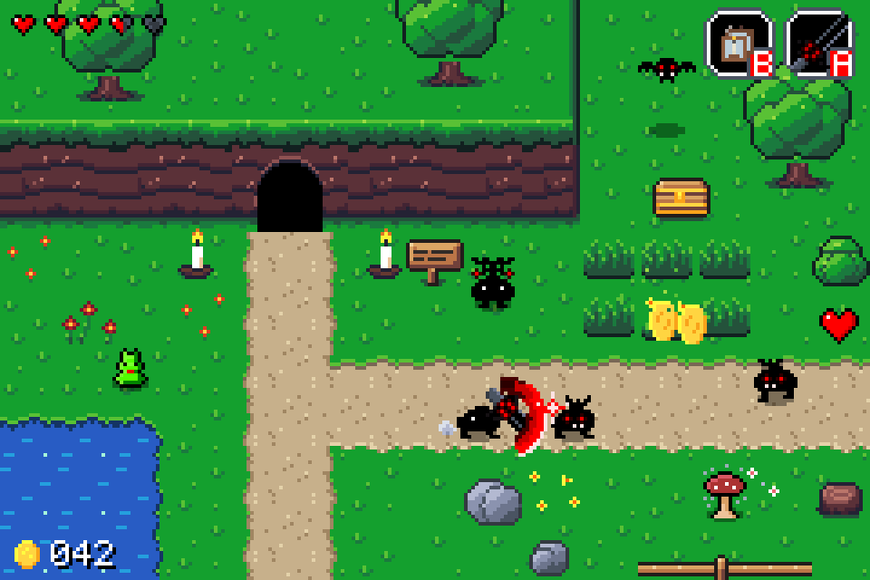
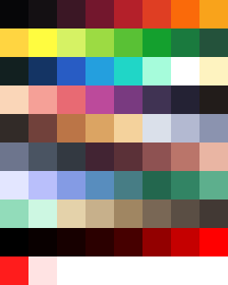
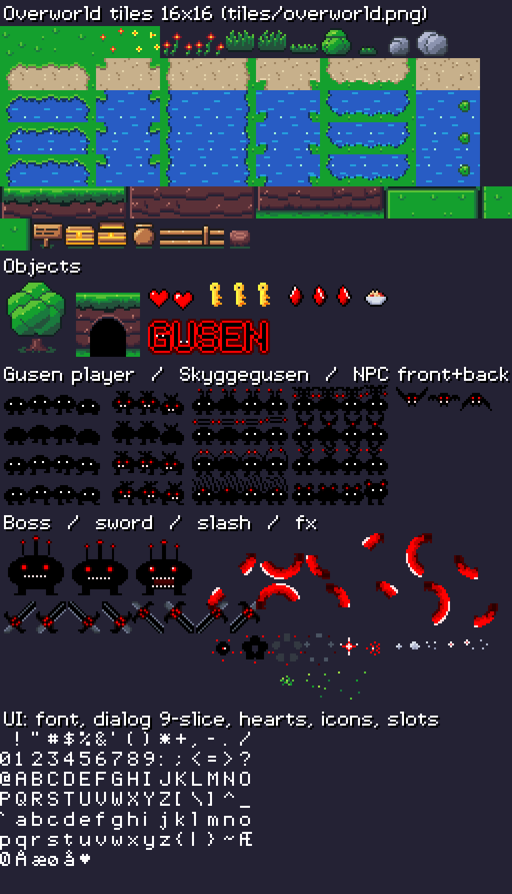
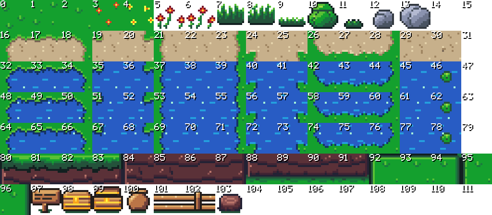
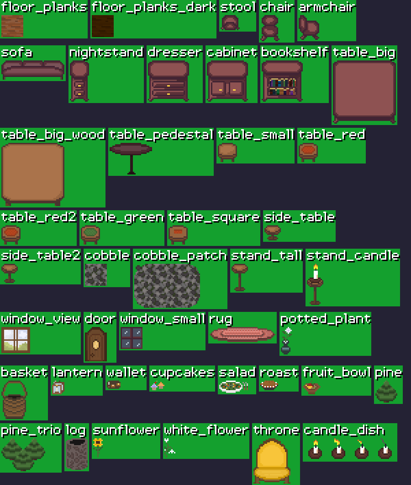
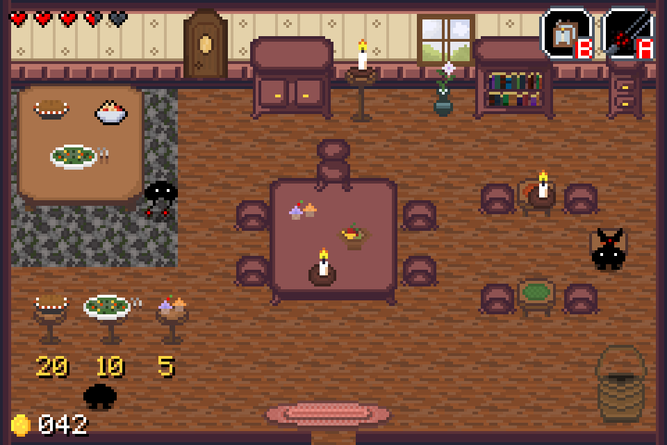
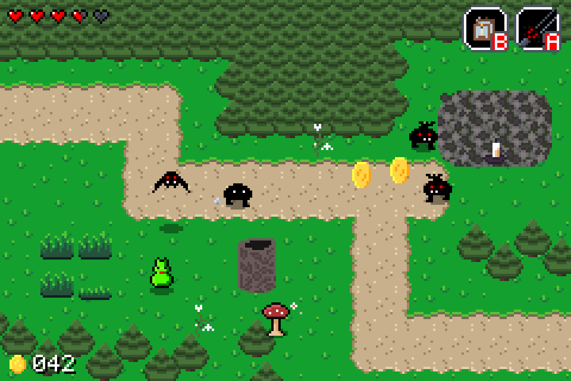
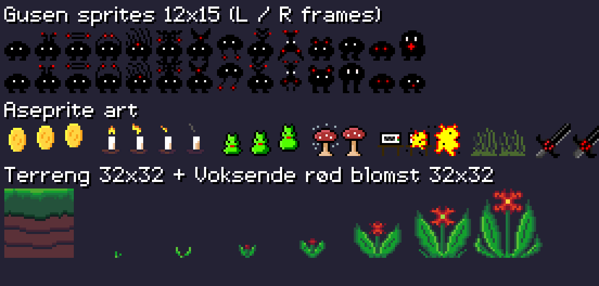

# Gusen art: style guide and asset catalogue

The files live in `game/assets/` (what the game loads) and `art/ase/`
(editable Aseprite copies).

All art here is authored at **1x** and is pixel perfect: every pixel is a colour
from the master palette, and alpha is 0 or 255. The one exception is the drop
shadow, which is 50% black. Nothing is resampled. The game renders to a
**240×160** screen (the GBA resolution) and scales that whole screen by a whole
number (×2, ×3, ×4…) with nearest-neighbour filtering.

Rebuild everything with:

```bash
pip install pillow
python3 tools/make_assets.py      # writes game/assets/, art/ase/, docs/img/
```



## The rules (taken from the art you already made)

| Rule | Where it comes from |
|---|---|
| **Screen 240×160, 16×16 tiles** (15×10 tiles per screen) | GBA hardware |
| **Characters are 12×15** | `player.png`, `npc*.png`, `*_12x15.ase` |
| **Gusens are pure `#000000` silhouettes.** No outline, no shading. Eyes are single `#ffffff` pixels, and facing is shown only by where the eyes sit (left 3,7 · front 3,8 · right 4,8 · back none). | every `*gusen.png` |
| **Red glow = Gusen ink.** Glowing bits use `#ff0000` with dark-red halo pixels (`#2b0000`, `#170000`) around them. White-hot core `#ffe3e3`. | `sprite3/4.png`, `lanternegusen.png`, `Glødende Sverd` |
| **Palette = AAP-64 + Gusen ink.** 74 colours total. | `Penge`, `Terreng`, `Voksende rød blomst` are already AAP-64 |
| **≤ 15 colours per sprite sheet / per 16×16 tile** (one GBA 4bpp palette) | GBA hardware; enforced by `make_assets.py` |
| **Outlines:** creatures and items are black (frog, mushroom, sword). Nature uses its own darkest shade (flower `#24523b`, cliff `#242234`). Props use warm near-black `#221c1a`. | frog / mushroom / flower / terrain |
| **Light from the top-left.** Lit edge on top/left, shade on bottom/right, 3–5 flat shades per material, no dithering. | coin, flower, terrain |
| **Animation timing** follows the originals: idle loops 400–500 ms/frame, pickups 200 ms, fast effects 50–100 ms. | frame durations in your `.ase` files |

Palette file for Aseprite / GIMP: `palette/gusen-master.gpl`
(Aseprite: *Palette → Load Palette*).



## What's here

| File | Size / frames | Animations (see `assets.json`) |
|---|---|---|
| `tiles/overworld.png` | 16×16 atlas, 16 × 7 | grass ×3, flower grass ×2, swaying flowers, tall grass (+cut), bush (+cut), rocks, **path autotile** (13 + 2 fills), **water autotile ×3 frames**, **cliff face** (top / mid / base × left end, 2 mids, right end), plateau rims, sign, chest (closed/open), pot, fence, stump |
| `tiles/tree.png` | 32×40 | — |
| `tiles/cave_mouth.png` | 32×32 | replaces a 2×2 block of cliff |
| `tiles/interior.png` | 16×16 atlas | Mega floor planks (light/dark) and cobblestone, plus **new walls** in the furniture's maroon: back wall top/bottom (with side-cap variants), side walls, front wall + corners, void |
| `mega/*.png` | as drawn | 43 curated pieces from `Mega_Spritesheet.ase`, pixels copied exactly (see below) |
| `sprites/gusen_player.png` | 12×15, 4 dirs × (idle, walkA, walkB, attack) | `walk_*` = A, idle, B, idle |
| `sprites/gusen_shadow.png` | 12×15, 4 dirs × (walkA, walkB, attack) | **Skyggegusen**, the red-eyed enemy |
| `sprites/gusen_bat.png` | 16×16 × 3 | wings up / mid / down |
| `sprites/gusen_boss.png` | 32×32 × 3 | **Skyggekongen**: idle ×2, telegraph (mouth open) |
| `sprites/gusen_npcs.png` | 12×15, 8 NPCs × (down, up, left, right) | new front/back frames for npc1, npc2, Ding, Gress, Lanterne, Luna, Wireless, sprite (left/right frames are your originals) |
| `items/heart.png` `key.png` `shard.png` `spaghetti.png` | 12×15 (like `Penge_12x15`) | bob / shine (the lantern is yours, from the Mega sheet) |
| `fx/sword.png` | 16×16 × 8 | Glødende Sverd moved onto the master palette, in 4 diagonals (flipped, never rotated), glow on/off |
| `fx/slash.png` | 24×24, 4 dirs × 3 | sword smear in the sword's red-glow ramp |
| `fx/poof.png` `hit.png` `dust.png` `leaves.png` `spores.png` `shadow.png` | 8–16 px | death smoke, hit spark, footstep dust, cut grass, mushroom spores, drop shadow |
| `ui/font.png` + `font.json` | 8×10 cells, variable width | full ASCII + **Æ Ø Å æ ø å** ♥ |
| `ui/dialog_box.png` | 24×24 9-slice (8 px borders) | |
| `ui/hearts.png` `icons.png` | 8×8 | heart full/half/empty · coin, key, shard |
| `ui/slot_a.png` `slot_b.png` `cursor.png` `more_arrow.png` `logo.png` | | |
| `ase/*.ase` | | every animated sprite as an Aseprite file with **tags per animation** and the master palette loaded |



Tile indices for level data (Tiled etc.):



### Autotiles (path and water)

Each autotile row is laid out as:

```
nw  n   ne  inner-nw  inner-ne
w   c   e   inner-sw  inner-se
sw  s   se  fill-2    fill-3
```

(stored as one row of 15 tiles). "inner-nw" is a mostly-path tile with a grass
notch in its top-left corner. For water, frames 2 and 3 are the same row
+16 and +32 tiles. The edge wobble repeats every 16 px, so any combination
tiles seamlessly.

## Mega_Spritesheet.ase: what's used and why

The Mega sheet is 400×400 with 271 colours. Its furniture is drawn in the
**same maroon ramp as Terreng** (`#8e5252` / `#5b3138` / `#422433` are AAP-64),
so it sits naturally next to the new tiles. Its grass is a separate, more olive
green family (`#61a53f`, `#477238`).

Picks are copied **pixel for pixel**: no recolouring, no scaling. Each one has
a job in the game (listed in `assets.json` → `note`). The build writes them to
`game/assets/mega/`.



| Picked | Job |
|---|---|
| floor planks (light, dark), **cobblestone** (the texture repeats every 16 px, so a 16×16 crop tiles seamlessly), cobble patch | house floors, kitchen and castle floors, shrine clearings |
| **all the tables** (big maroon, big wood, pedestal, small, 4 cloth tables, 2 side tables) | restaurant, kitchen worktable, shop displays, houses |
| stool, chair, armchair, sofa, nightstand, dresser, cabinet, bookshelf, rug, potted plant, basket | Gusen house interiors; basket = breakable container |
| door, window (view), window (small) | house walls inside and out |
| candle stands (unlit / lit), candle dish (4-frame blow-out) | indoor candles = checkpoints, same timing as *Blåse ut lys* |
| lantern (candle inside) | **Lanterne-Gusen's key item** (replaces the generated one) |
| wallet | wallet upgrade: carry more Penge |
| cupcakes, salad, roast, fruit bowl | Spaghetti-Gusen's shop: ½ / 1 / 2 hearts |
| pine, pine trio, hollow log | Skogen (the forest) |
| sunflower, white flower | Gress-Gusen's garden, wildflowers |
| golden chair | Skyggekongen's throne |

**Left out on purpose** (all still in the `.ase`, easy to add later):

| Skipped | Why |
|---|---|
| grass tiles, dirt decals, dirt-ring autotile, grass islands, hedge | second grass family: two greens on one screen clash |
| dirt patch with hole, 32×32 dirt | duplicates the path autotile |
| cave hole | duplicates `tiles/cave_mouth.png`, which fits into the cliff |
| TVs, TV desk | low contrast at 1x; the desk has 44 colours |
| aquarium | 37 colours (GBA limit 15) and very busy |
| pink loveseat | 20 colours, louder than the rest of the maroon set |
| narrow cabinet, round stool, sofa with plants, cupcake plate, low bookshelf, 2nd potted plant, extra sunflowers, 2nd cobble patch | near-duplicates of picked pieces |
| table candle, candle strip | same animation as *Blåse ut lys* / the candle dish |
| black square, green mat | placeholders |

Over the 15-colour limit among the picks: **bookshelf** (30, from the book
spines). Reduce it in the palette pass.

| Interior (Mega furniture + new walls) | Forest (Mega pines, log, cobblestone) |
|---|---|
|  |  |

### The existing art these build on

JPGs are excluded (lossy, so they can't be pixel perfect).



## Workflow

* `tools/make_assets.py` is the source of truth for everything in this folder
  right now. It checks every sheet against the palette and the 15-colour rule,
  and fails the build if either is broken.
* Want to hand-edit something? Open `art/ase/<name>.ase` in Aseprite, then
  export PNG over `game/assets/<folder>/<name>.png` (*File → Export Sprite Sheet*,
  by rows, no padding). After that, **remove that sprite from
  `make_assets.py`** so the generator doesn't overwrite your edit.
* Never scale inside the art. If something needs to be bigger, draw it bigger
  at 1x.
